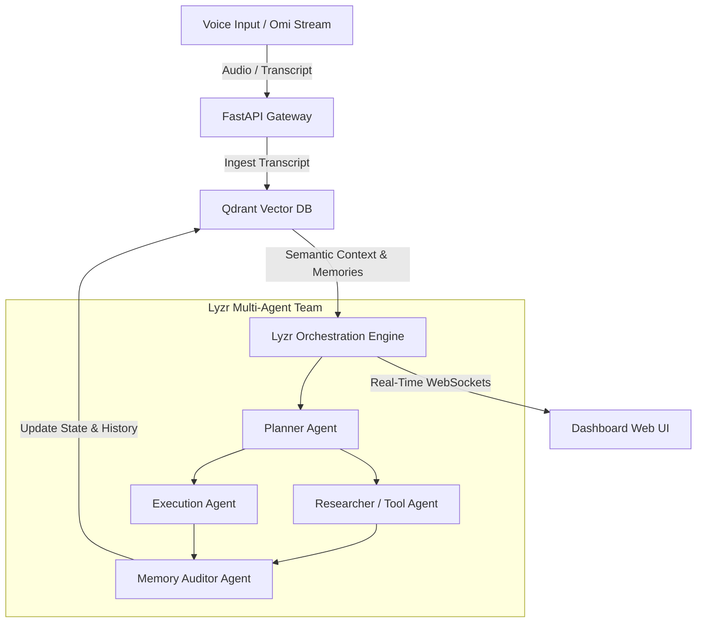

# Requirements Document & Hackathon Strategy Analysis

**Competition**: [Stop Prompting. Code Solo Agents Hackathon 2026](https://app.hidevs.xyz/competitions/hackathons/stop-prompting-solo-agents-hackathon-2026)  
**Organizers & Sponsors**: HiDevs, Lyzr, Qdrant, and Omi  
**Timeline**: August 31, 2026 – September 8, 2026 (11:59 PM IST) | Winners Announced: September 10, 2026  
**Format**: Solo-only (1 developer per entry)  
**Prizes**: 1st: ₹5,000 | 2nd: ₹3,000 | 3rd: ₹2,000 + Certificates of Excellence  

---

## Executive Summary & Core Hackathon Philosophy

The **"Stop Prompting. Code Solo Agents"** hackathon challenges participants to move past naive single-turn prompt engineering and basic LLM wrappers. The goal is to build **stateful, autonomous, voice-driven AI agents** that:
1. **Listen ambiently** via voice input (Omi hardware / stream).
2. **Maintain long-term memory** across interactions (Qdrant vector database).
3. **Execute complex multi-agent workflows autonomously** without requiring manual step-by-step user prompts (Lyzr agent orchestration framework).

---

## Part 1: Hackathon Deep-Dive Analysis

### 1. Mandatory Sponsor Stack Synergy
Winning this hackathon requires deep integration of all three core sponsor technologies:

| Sponsor Technology | Role in System Architecture | Key Capability to Showcase |
| :--- | :--- | :--- |
| **Omi** | Ambient Voice Capture | Hardware/stream voice ingestion, continuous listening, real-time command triggers. |
| **Qdrant** | Persistent Memory Layer | Vector database for episodic & semantic memory, hybrid retrieval, payload metadata indexing. |
| **Lyzr** | Agentic Orchestration | Multi-agent framework for task delegation, autonomous sub-agent spawns, stateful tool execution. |

### 2. Judging & Evaluation Criteria
* **Autonomy (No Manual Prompting)**: Does the system act proactively based on voice intent, avoiding manual prompt babysitting?
* **Deep Sponsor Stack Integration**: How seamlessly are Omi, Qdrant, and Lyzr connected in the execution loop?
* **Real-World Utility**: Does the project solve an actual, high-value problem with deterministic execution?
* **Repository & Presentation Quality**: Is the GitHub code modular and clean, with a clear visual architecture diagram in `README.md` and a crisp $\le$ 5-minute video demo?

---

## Part 2: Track Recommendation & High Winning Potential Strategy

### Track Overview
1. **Track 1**: Meeting & Lecture Intelligence (*Voice-to-insight engines*)
2. **Track 2**: Collaborative Multi-Agent Workflows (*Voice-triggered execution pipelines*)
3. **Track 3**: Privacy-First Knowledge Systems (*Secure memory architectures*)
4. **Track 4**: Accessibility & Adaptive Assistants (*Voice-driven engines for structured outputs*)
5. **Track 5**: Continuous Health & Habit Tracking (*Frictionless voice-based logs*)
6. **Track 6**: Open Innovation (*Wildcard applications*)

---

### 🥇 Strategic Track Recommendation: Track 2 (Collaborative Multi-Agent Workflows)

> **Recommended Track**: **Track 2: Collaborative Multi-Agent Workflows** *(combined with Track 4: Adaptive Copilot Capabilities)*  
> **Winning Potential Score**: **95 / 100**  
> **Proposed Project Name**: **OmniAgent OS — Autonomous Voice-Driven Multi-Agent Executive**

#### Strategic Rationale:
1. **Avoids Crowded Track 1**: 60-70% of participants will build basic meeting summarizers ("transcribe audio $\rightarrow$ summarize text"). Judges get fatigued seeing minor variations of the same wrapper.
2. **Highlights Sponsor Strengths**:
   * **Omi** provides the voice stream trigger.
   * **Qdrant** serves as the central shared vector memory across sub-agents.
   * **Lyzr** orchestrates the team of autonomous sub-agents (Planner Agent, Researcher Agent, Execution Agent, Memory Auditor).
3. **Maximum Judge Impact**: Demonstrating a hands-free voice prompt (e.g., *"Omni, prepare the competitive market briefing for tomorrow's investor meeting based on last week's voice notes"*) causing Qdrant to retrieve past memories, and Lyzr to spawn parallel agents that research, create deliverables, and log execution in real-time on a visual web dashboard.

---

## Part 3: Product Requirements Document (PRD)

### 1. App Overview
* **App Name**: OmniAgent OS
* **One-Line Description**: An ambient voice-triggered multi-agent ecosystem that converts spoken intent into persistent Qdrant memories and executes multi-agent Lyzr pipelines autonomously.
* **Target Audience**: Executives, power-users, and developers needing hands-free automation during workflows or mobility.

### 2. Problem Statement
Current AI assistants require constant text prompting, lack stateful long-term memory across sessions, and operate as single-turn chat interfaces rather than autonomous multi-agent teams.

### 3. Core Features
1. **Voice Ingestion Engine**: Real-time voice capture via Omi audio stream or web microphone fallback.
2. **Qdrant Hybrid Memory Core**: Stores episodic memory vectors with rich payload metadata (entities, timestamps, categories).
3. **Lyzr Autonomous Multi-Agent Team**:
   * *Planner Agent*: Analyzes intent and queries Qdrant memory.
   * *Task Executor Agent*: Runs tool calls, research synthesis, and API actions.
   * *Memory Auditor Agent*: Summarizes execution outcomes and writes back to Qdrant memory.
4. **Real-Time Visual Dashboard**: Glassmorphism UI displaying voice input status, vector memory stream, and interactive multi-agent execution graphs via WebSockets.

### 4. User Stories
* *As a user*, I want to speak instructions naturally without typing, so that my context is captured hands-free.
* *As a system*, I want to index voice transcripts into Qdrant vector database, so that past preferences and context persist across sessions.
* *As a user*, I want Lyzr agents to decompose my voice request into sub-tasks autonomously, so that I don't have to prompt-babysit every step.

---

## Part 4: Technical Requirements Document (TRD)

### 1. System Architecture Diagram



### 2. Tech Stack Specification

| Component | Technology Choice | Function / Purpose |
| :--- | :--- | :--- |
| **Frontend** | HTML5 / Vanilla CSS / JavaScript | Modern glassmorphism dark-mode UI with live agent graph |
| **Backend** | Python 3.11 / FastAPI | Async REST API gateway & WebSockets streaming server |
| **Vector Memory** | Qdrant Cloud / Local Vector Engine | Storing 384-dim embeddings & payload metadata |
| **Agent Framework** | Lyzr Automata / Agent API | Multi-agent task planning, tool execution, and state management |
| **Voice Ingestion** | Omi Audio Stream / Web Audio API | Real-time audio transcript ingestion |

### 3. Qdrant Payload Schema

```json
{
  "collection_name": "omni_agent_memories",
  "vectors": {
    "size": 384,
    "distance": "Cosine"
  },
  "payload": {
    "memory_id": "UUID string",
    "source": "omi_voice | agent_execution",
    "category": "instruction | fact | calendar | research",
    "timestamp": "ISO8601 UTC string",
    "raw_text": "string text of the memory",
    "entities": ["list of strings"],
    "tags": ["list of strings"]
  }
}
```

---

## Part 5: Step-by-Step Hackathon Roadmap (Aug 31 – Sept 8)

* **Step 1 (Day 1)**: Setup FastAPI backend, Qdrant collection schema, and Lyzr Agent credentials.
* **Step 2 (Day 2-3)**: Connect Omi voice ingestion pipeline to Qdrant memory insertion and RAG search.
* **Step 3 (Day 4-5)**: Implement Lyzr multi-agent workflow (Planner $\rightarrow$ Executor $\rightarrow$ Auditor) and connect real-time WebSockets.
* **Step 4 (Day 6)**: Build visual Glassmorphism Dashboard UI showing real-time agent execution graph.
* **Step 5 (Day 7)**: Conduct end-to-end testing, record $\le$ 5-minute video demo, finalize GitHub `README.md` with architecture diagram, and submit via HiDevs portal before Sept 8, 11:59 PM IST.
