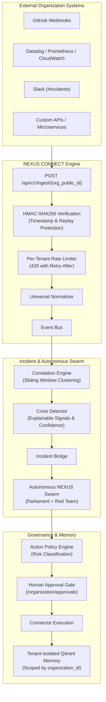

# NEXUS FORGE — Autonomous Crisis Command

An autonomous multi-agent crisis command and response platform that captures voice
command input (Omi), reasons and delegates across a swarm of specialized AI agents
(Lyzr Agent Framework), and retains persistent cross-mission memory in Qdrant.

Built for the **Lyzr × Qdrant × Omi "The Dawn of the Autonomous AI Builder"** hackathon.
It integrates all three mandatory sponsor technologies end-to-end:

| Pillar | Role in the pipeline | Live path |
|---|---|---|
| **Omi** | Real-time microphone voice capture (Web Speech API verbatim STT + Gemini audio transcribe), wake-word activation, `/v4/listen` ambient streaming protocol, automated mission launch | `app/services/omi_service.py` + `/api/v1/missions/voice-ingest` + `/api/v1/missions/omi-webhook` |
| **Qdrant** | Persistent dense semantic vector memory via Qdrant's official FastEmbed (`BAAI/bge-small-en-v1.5`, 384-dim) across 9 collections (mission, decision, failure, workflow, agent, dissent, reflection, domain, cross_domain) | `app/memory/qdrant_client.py` (real cloud or in-memory Qdrant + FastEmbed ONNX) |
| **Lyzr** | Multi-agent orchestration, dynamic LLM deliberation, and task execution by specialized swarm agents | `app/agents/lyzr_client.py` + `app/agents/runtime.py` + `app/agents/llm_reasoning.py` |
| **Org Connectors** | Real event-pipeline ingestion (GitHub / Slack / monitoring / webhook / custom API / support) → correlation → incident → auto-triggered NEXUS mission | `app/connectors/` + `app/pipeline/` + `app/api/connectors.py` |

The platform also includes an **Organization Connector Platform**: connect your org's
systems, normalize their signals into canonical events, correlate burst signals into
crises, and auto-escalate straight into an autonomous NEXUS mission (agents gain live
connector read/propose/execute tools). See the **Connector Platform** section below and
the "Connectors" tab in the frontend.

---

## Quick start

### Requirements
- Python **3.12** (standard CPython, MSVC build). **Do not use an MSYS2/UCRT Python** —
  it cannot install binary wheels for `numpy`, `grpcio`, or `qdrant-client`.
- Node.js (only for serving the static frontend).

### 1. Create a clean virtualenv with standard CPython 3.12

```powershell
cd backend
py -3.12 -m venv .venv
.\.venv\Scripts\python.exe -m pip install --upgrade pip
.\.venv\Scripts\python.exe -m pip install -r requirements.txt
```

> Confirm the interpreter is a `win_amd64` CPython, not `mingw`:
> `powershell -NoProfile -Command "py -3.12 -c 'import platform;print(platform.python_compiler())'"`

### 2. Configure credentials

Copy the example and fill in secrets — **never commit `.env`** (already git-ignored):

```powershell
Copy-Item .env.example .env
notepad .env
```

Add your real keys:

```
OMI_API_KEY=your_omi_api_key
LYZR_API_KEY=sk-your_real_lyzr_key
LYZR_BASE_URL=https://agent-prod.studio.lyzr.ai
QDRANT_URL=https://<your-cluster>.cloud.qdrant.io:6333
QDRANT_API_KEY=your_qdrant_key
GEMINI_API_KEY=your_gemini_key   # optional (LLM augmentation)
```

- When a **valid (non-placeholder)** Lyzr key is present, mission tasks are genuinely
  delegated to the Lyzr Agent Framework over HTTP. With a placeholder/absent key the
  system transparently falls back to a deterministic offline runtime so it still works
  in demo mode.
- Same for Omi: with a real key the live Omi transcribe endpoint is called; otherwise an
  acoustic heuristic decoder is used.
- Qdrant: uses the cloud endpoint if `QDRANT_URL` is set, otherwise an in-memory Qdrant
  instance — either way backed by real `qdrant-client`.

### 3. Run the backend

```powershell
.\.venv\Scripts\python.exe -m uvicorn app.main:app --host 0.0.0.0 --port 8000
```

Verify: <http://localhost:8000/health> should return `200`. Interactive API docs at
<http://localhost:8000/docs>.

### 4. Run the frontend

```powershell
python -m http.server 5500 --directory ..\frontend
```

Open <http://localhost:5500>.

### 5. Run the test suite

```powershell
# Run backend pytest suite
cd backend
.\.venv\Scripts\python.exe -m pytest -q

# Run frontend test suite
cd ..
node --test frontend/tests/frontend.test.js
```

All tests must pass (current: **54 backend tests passed** + **5 frontend tests passed** = **59 total passing tests**).

---

## 60-second demo script

1. Open the frontend at `http://localhost:5500`.
2. In the voice panel, either **click-to-record** and speak (or upload) the crisis phrase,
   or select the preset: **"NEXUS, metropolitan power grid experiencing cyber-attack
   on substations 04 and 09. Initiate defense protocol."**
3. The platform transcribes (Omi), detects the wake word, and auto-launches a Mission.
4. Watch the **AI Organization** panel: a manager agent delegates to specialized
   division agents (Grid, Supply Chain, Higher-Ed) which deliberate, vote, and form a
   unified strategy + consensus gauge.
5. Open the **Memory / Vector DB** tab to see the Qdrant collections fill with mission,
   decision, and failure memory across runs.
6. Re-run a similar incident to observe **cross-mission memory recall** changing the plan.

---

## NEXUS CONNECT — Zero-Code Multi-Tenant Integration

NEXUS CONNECT enables external organizations to connect their infrastructure (GitHub, Datadog, Prometheus, Slack, AWS CloudWatch, microservices) **without modifying their application code or modifying the core NEXUS engine**.

$$\text{ONE NEXUS FORGE CODEBASE} \longrightarrow \text{MANY ORGANIZATIONS} \longrightarrow \text{ORGANIZATION-SPECIFIC CONFIGURATION}$$

### Architecture & Pipeline



### Key Capabilities

1. **Zero-Code Ingestion**:
   - Webhook URL: `POST /api/v1/ingest/{organization_public_id}`
   - External platforms push standard JSON payloads without any custom SDK installed.
   - Quick HTTP 202 Accepted response (< 50ms) to satisfy external webhook delivery deadlines.
2. **Enterprise HMAC-SHA256 Security**:
   - Verifies `X-Nexus-Signature` over `timestamp + body` using constant-time comparison.
   - Replay protection rejects duplicate `X-Nexus-Event-Id` idempotently.
   - Rejects timestamps older than 5 minutes.
3. **Multi-Tenant Isolation**:
   - Strict boundaries for events, incidents, missions, approvals, and audit logs.
   - All Qdrant vector memory lookups and storage are strictly scoped by `organization_id`.
4. **Human-in-the-Loop Governance**:
   - `ActionPolicyEngine` classifies actions into `LOW`, `MEDIUM`, `HIGH`, `CRITICAL`.
   - High-risk remediations (e.g. rollbacks, service restarts) require explicit operator approval.
   - Server-side validation prevents unauthorized execution.

### Organization Onboarding & Webhook Integration

1. Create a workspace:
   ```bash
   curl -X POST "http://localhost:8000/api/v1/organizations" \
     -H "Content-Type: application/json" \
     -d '{"name": "Stripe Payments", "industry": "fintech"}'
   ```
2. The response returns:
   - `ingestion_endpoint`: `http://localhost:8000/api/v1/ingest/org_stripe_xxxx`
   - `ingestion_secret`: high-entropy secret (displayed once)
3. Configure your external service with the endpoint and HMAC headers.
4. Send an event:
   ```bash
   curl -X POST "http://localhost:8000/api/v1/ingest/<org_public_id>" \
     -H "Content-Type: application/json" \
     -H "X-Nexus-Event-Id: evt_12345" \
     -H "X-Nexus-Timestamp: 2026-09-03T09:00:00Z" \
     -d '{"resource": "payment-api", "event_type": "SERVICE_FAILURE", "severity": "critical", "error_rate": "42%", "summary": "Payment API error rate spike"}'
   ```

---

## Project layout

```
backend/
  app/
    main.py                 FastAPI app, lifespan, /health, router mounting
    api/
      ingest.py             Universal zero-code ingestion endpoint (/api/v1/ingest/{public_id})
      organizations.py      Standardized Multi-Tenant REST API (/api/v1/organizations)
      connectors.py         /platform/* REST + command-center endpoints
      demo_seed.py          seeds org_acme_digital + demo connectors & policies
      websocket.py          /ws/organizations/{org_id}/events live org stream
      missions.py           mission lifecycle & events
    connectors/             Organization Connector Platform SDK
      base/                 schemas, authentication, events, permissions, Connector ABC
      policy_engine.py      ActionPolicyEngine & human approval governance
      agent_tools.py        ConnectorToolRegistry (read/propose/execute, approval-gated)
      github/ slack/ monitoring/ webhook/ custom_api/ support/ concrete connectors
    pipeline/               event_bus, normalizer, correlator, crisis_detector, ingestion, incident_bridge
    memory/                 qdrant_client (tenant-isolated Qdrant), retriever, writer
    orchestration/          mission_engine, dag_engine, adaptive_org_engine, debate_engine
    db/                     Async SQLAlchemy models (ActionApproval, OrganizationPolicy, Organization, Mission, etc.)
  tests/                    pytest suite (54 comprehensive tests covering security, tenant isolation, mission flow, and sponsor stack)
frontend/
  tests/                    Node.js test suite (5 UI, DAG algorithm, vector distance, and audio synthesis tests)
```

---

## Production Deployment (Render + Vercel)

### 1. Backend on Render
- **Blueprint Deploy**: Connect your GitHub repository to [Render](https://render.com). Render automatically detects `render.yaml` at the root.
- **Manual Web Service Deploy**:
  - Environment: `Python 3`
  - Build Command: `pip install -r backend/requirements.txt`
  - Start Command: `uvicorn app.main:app --host 0.0.0.0 --port $PORT` (or use `backend/Procfile`)
  - Root Directory: `backend`
  - Add environment variables as listed in `backend/.env.example` (or set `DEMO_MODE=true` for zero-configuration startup).

### 2. Frontend on Vercel
- Import the repo into [Vercel](https://vercel.com).
- Root Directory: `./frontend` (or root using `vercel.json`).
- Framework Preset: `Other` (Static HTML/JS).
- The frontend dynamically detects if it's running on localhost or cloud. In the UI, click **Backend: Connected** (top right) to view or override the API URL anytime.

### 3. Uptime Bot (Render Free Tier Sleep Prevention)
- Add a periodic monitor (e.g. [UptimeRobot](https://uptimerobot.com) or [Cron-Job.org]) pinging your Render backend every 5–10 minutes:
  - **URL**: `https://<your-render-backend-url>/ping`
  - **Method**: `GET` or `HEAD`
  - Returns: `200 OK` with `{"status": "ok", "pong": true}` with minimal resource consumption.

---

See `ARCHITECTURE.md` for the detailed integration design and data flow.